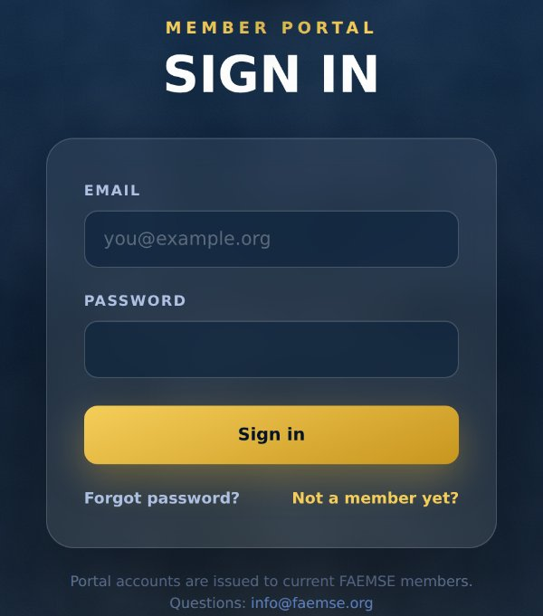
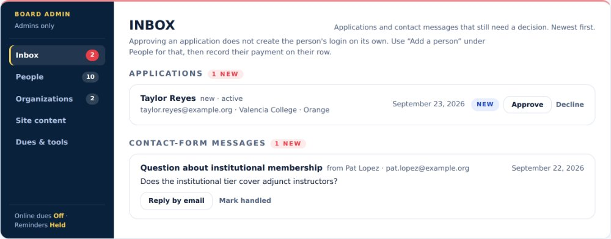
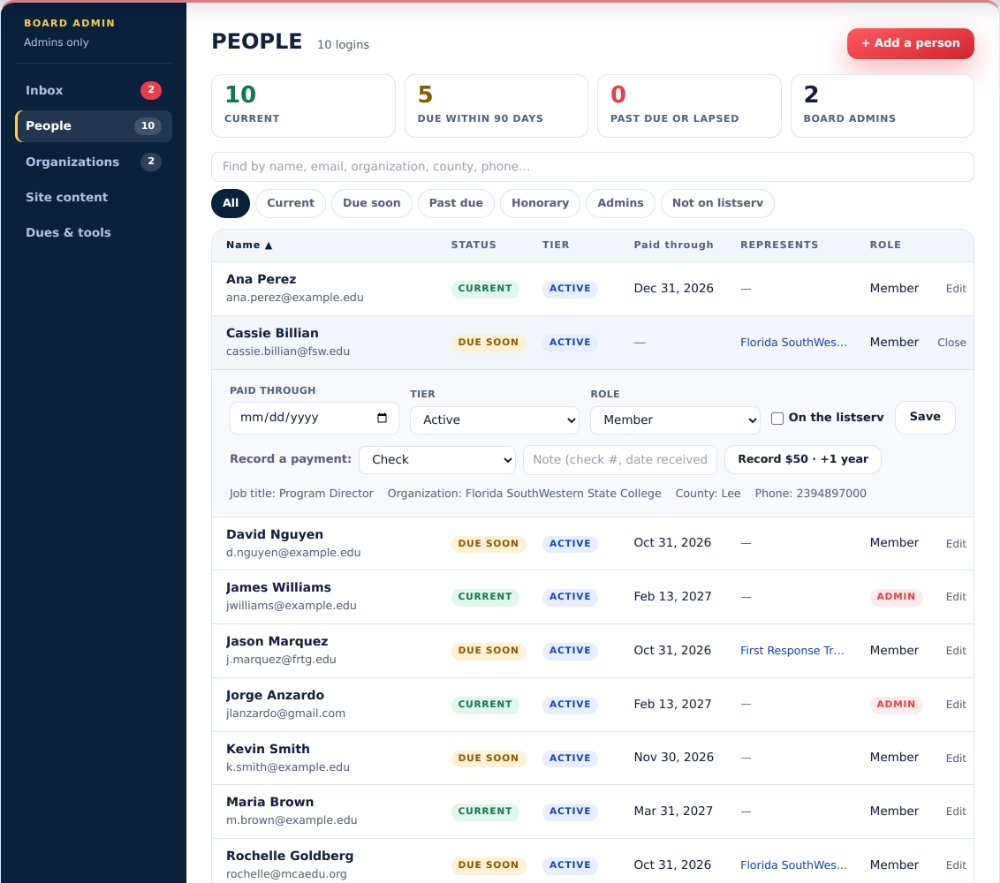
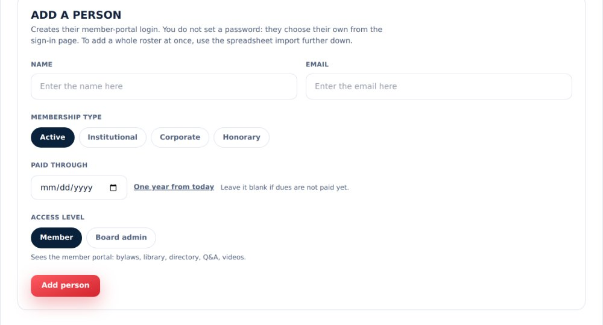
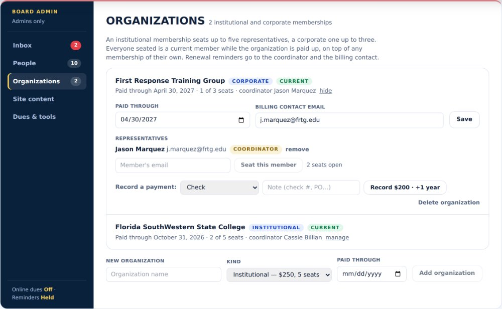
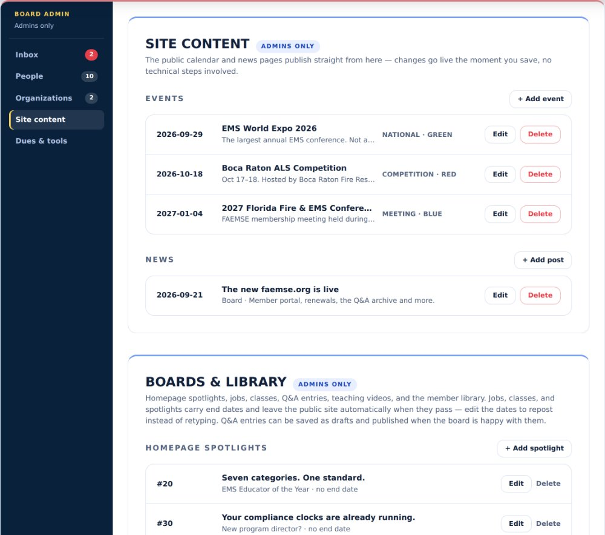
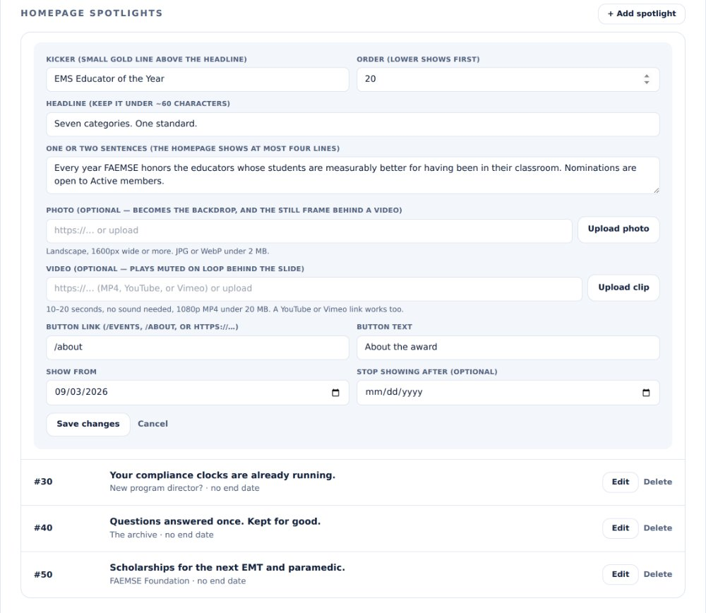
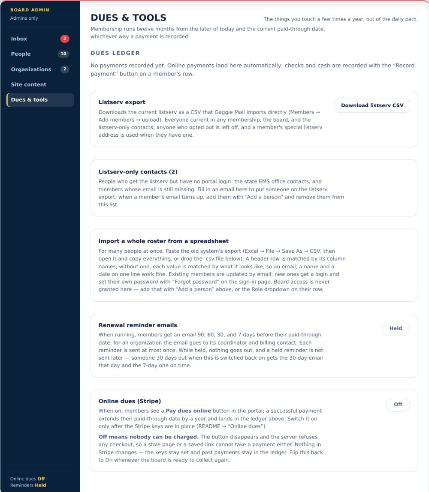
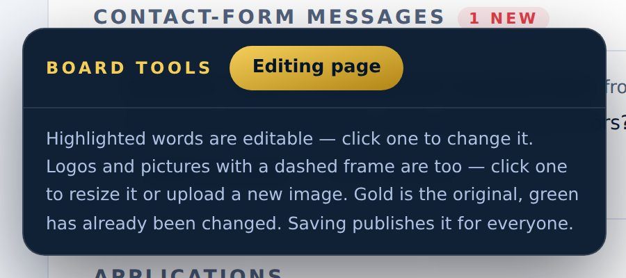

# Board admin guide

How a board admin runs faemse.org day to day. Everything here happens on the
website itself; there is no separate admin system to log in to. The screenshots
show the panels with sample data.

## 1. Sign in

Go to **faemse.org/login** and sign in with your email and password. If you
have never set a password, or forgot it, type your email and click **Forgot
password**. A reset link is emailed to you and lands you on a "Set a new
password" card in the portal.

After signing in you land on **faemse.org/members**. The line under the
welcome banner shows who you are signed in as and an **ADMIN** badge. Board
admins see a **Board admin** workspace that members do not, plus a dark
**Board tools** bar in the bottom-left corner.

## 2. The Board admin workspace

The workspace has five areas down its left side, each with a count. On a
phone the five sit in a row across the top instead.

- **Inbox**: applications and contact messages waiting for a decision.
- **People**: every login, one line each.
- **Organizations**: institutional and corporate memberships.
- **Site content**: events, news, spotlights, boards and the library.
- **Dues & tools**: the ledger, listserv export, roster import and the two
  switches.

### Inbox

Anything sent through the public Contact page and every membership
application lands here. **Reply by email** opens a reply in your mail program;
**Mark handled** files a message away. Applications have **Approve** and
**Decline**; a renewal form from someone who already has a record also shows
**Paid · +1 year**, which records the payment and extends them in one click.
Approving does not create the person's login; do that with **Add a person**
under People. The red number on the Inbox tab is how many items are waiting.

### People

One line per person: name and email, a status pill, tier, paid-through date,
the organizations they represent, and role. The four tiles at the top show how
many are current, due within 90 days, past due or lapsed, and board admins;
click a tile to see just those people. The chips below do the same for the
usual questions, and the search box finds anyone by any words you type, in any
order: a name, part of an email, a college, a county, a phone number.

Click a person's row to open their editor right under it. There you change
the **Paid through** date, the **Tier**, the **Role** (Member or Admin) and
the **On the listserv** box, then click **Save**. To record dues received by
check or cash, pick the method, type a note such as the check number, and
click **Record $50 · +1 year**. That writes the dues ledger and moves the
paid-through date twelve months forward from the later of today and the
current date, so paying early never loses time. Click the row again to close
it. The list shows 25 people at a time with page numbers underneath.

**+ Add a person** (top right) creates a member's portal login. Enter the name
and email, pick the membership type, set the paid-through date (the **One year
from today** link fills it in) and choose the access level. You never set a
password; the person uses **Forgot password** on the sign-in page to choose
their own. Pick **Board admin** only for board members who should see this
workspace.

### Organizations

Institutional memberships seat up to five people and corporate memberships up
to three. Use the search box to find one by name, coordinator or
representative. Click **manage** on an organization to set its paid-through
date and billing contact, seat a member by email, make someone the
coordinator, remove a seat, record the organization's payment, or delete the
organization. Add a new one with the form at the bottom. Everyone seated is a
current member while the organization is paid up.

### Site content

Everything the public and members see. Under **Events**, click **+ Add
event** to add one, **Edit** to change it, or the red **Delete** button to
remove it. Delete asks you to confirm and then the event is gone from the
public site immediately. **News** works the same way with **+ Add post**.

Below those, **Homepage spotlights**, the **Job board**, the **Class board**,
the **Q&A archive**, **Teaching videos** and the **Member library** each have
an **+ Add** button. Jobs, classes and spotlights carry end dates and drop off
the public site by themselves when the date passes. Q&A entries save as
drafts; tick the **Published** box when the board is happy with one, otherwise
members never see it.

#### The rotating homepage slides

The first slide on the homepage is the mission statement and its words are
edited with **Edit page** (section 3). Every slide after it is a **homepage
spotlight**, and those are changed here, not with Edit page. Click **Edit** on
the spotlight, change the kicker, headline, sentences, button or dates, and
click **Save changes**. The homepage updates right away. **+ Add spotlight**
adds a new slide, **Delete** removes one, and the **Order** number sets the
sequence. A spotlight with a "Stop showing after" date leaves the homepage on
its own when the date passes.

While Edit page is on, each spotlight slide shows a note pointing back here,
so nobody has to remember the difference.

### Dues & tools

The things you touch a few times a year.

- **Dues ledger** lists every recorded payment.
- **Download listserv CSV** builds the current mailing list (current members,
  the board, and the listserv-only contacts, minus anyone opted out) in the
  format Gaggle Mail imports.
- **Listserv-only contacts** are people who should get the listserv but have
  no portal login, such as the state EMS office. Add, edit or remove them here.
- **Import a whole roster** takes a .csv file or pasted rows for many people
  at once. Always click **Check (no changes)** first; it reports what would be
  created or updated without writing anything. Then click **Import members**.

Two switches sit at the bottom and both should stay as they are until the
board decides otherwise:

- **Renewal reminder emails** is **Held**. When switched to Running, members
  get automatic emails 90, 60, 30 and 7 days before their paid-through date.
- **Online dues (Stripe)** is **Off**. Off means nobody can pay by card on the
  site and nobody can be charged. Recording checks and cash still works.

## 3. Editing the wording on any page

The dark **Board tools** bar in the bottom-left corner appears on every page
while you are signed in as an admin. Click **Edit page** and the editable
words on that page get a highlight. Click a highlighted word or sentence, type
the change and save; it is live for everyone at once. Logos and pictures with
a dashed frame can be swapped or resized the same way. Click **Editing page**
again to leave edit mode. The bar also lists everything that has been changed
so it can be restored to the original.

## Things that need a board decision first

- Switching **Renewal reminder emails** to Running.
- Switching **Online dues** to On.
- Giving anyone else **Board admin** access.
- Deleting members or organizations (it cannot be undone).
